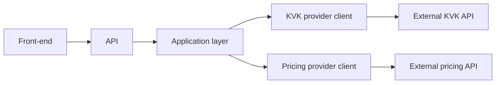
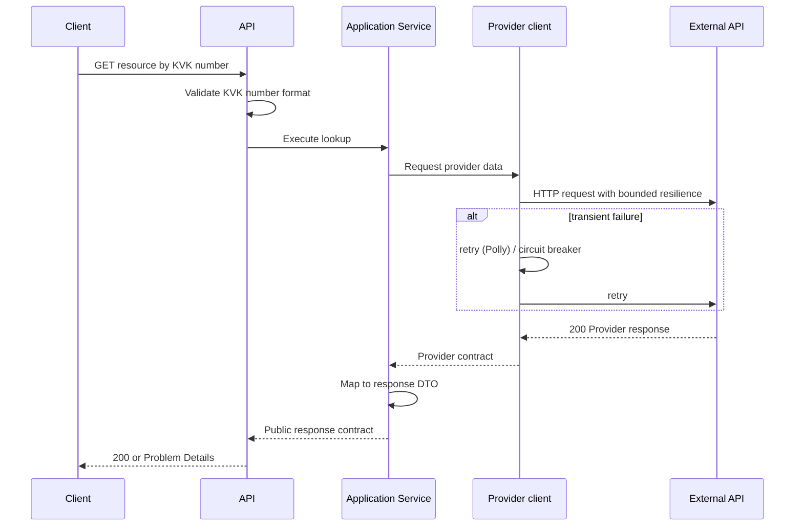

# Eneco B2B CompanyInsights Backend Design — KVK Lookup and Competitor Pricing

## 1. Purpose and Scope

Provide two read APIs for a B2B front-end:

- look up a company by an eight-digit KVK number;
- retrieve competitor pricing using the KVK number input.

The service owns a stable public contract, translates the two external API contracts, and bounds the impact of external failures through cancellation, timeouts, retries, and predictable error responses.

### Assumptions and open questions

| Type | Item |
| --- | --- |
| Assumption | A KVK number is validated only as exactly eight ASCII digits; no checksum requirement is stated. |
| Assumption | The external APIs are the system of record; this service stores no data. |
| Open question | The supplied public response example maps pricePerKwh to price and ignores the gas product. The implementation therefore returns items with pricePerKwh and excludes gas-only items. Because this behavior is implied rather than explicitly specified, it should be confirmed with the product owner. |
| Open question | Does “no pricing data” mean `404 Not Found` or `200 OK` with an empty `prices` array? This should be agreed with the front-end consumer. |
| Future consideration | Authentication, traffic controls, caching, and telemetry must be defined before production based on exposure, load, freshness, and operational requirements. |

## 2. Architecture

| Boundary | Responsibility |
| --- | --- |
| API | Routing, request validation, HTTP status codes, and public response contracts. |
| Application layer | Execute each lookup use case and map provider data into the public contract. |
| Provider clients | Isolate external URLs, authentication, HTTP transport, serialization, and provider failure handling. |
| Cross-cutting policies | Translate failures into consistent Problem Details responses and provide structured logging, cancellation, and bounded resilience . |

The implementation is a single deployable project. The boundaries remain explicit through interfaces and separate models, allowing a later project split without changing the public API.

## 3. API Design

| Method and route | Description | Success response |
| --- | --- |---|
| `GET /api/companies/{kvkNumber}` | Company details from KVK Finder | `200` + Company KVK, name, postal code, city, and industry. |
| `GET /api/companies/{kvkNumber}/competitor-pricing` | Competitor pricing for the company identified by a KVK number | `200` + Company KVK and a list of product/price pairs. |

Both operations are read-only and idempotent. Invalid KVK formats are rejected before an external call. 

External payloads are not exposed directly; they are translated into `Response DTOs` owned by this API so provider changes do not automatically become front-end breaking changes.

### Error semantics

| Status | Meaning |
| --- | --- |
| `400` | The KVK number is not exactly eight ASCII digits or includes non-numeric characters. |
| `404` | The requested resource is not known to the relevant provider. Whether a known company with no available prices returns 404 or 200 with an empty list remains a contract decision. |
| `502` | An external API could not be reached or returned an unusable response. |
| `504` | An external API exceeded the request time budget. |
| `500` | An unexpected failure occurred within this service. |

Errors use a consistent Problem Details response and do not expose internal exception messages.

## 4. Data Flow

The same pattern applies to both endpoints.

Cancellation flows through the complete request. Transient failures may be retried only within a bounded time limit; retries do not hide persistent failures, which are translated into predictable `502` or `504` responses.

## 5. Key Decisions and Trade-offs

| Decision | Benefit | Cost / risk |
| --- | --- | --- |
| **Own stable public contracts instead of exposing provider DTOs** | Protects the front-end from provider-specific names and shapes. | Requires explicit mapping and a policy for ambiguous fields such as price unit and currency. |
| **Single project/deployable instead of multi-project Clean Architecture** | Keeps a small service easy to navigate and deliver. | Boundaries rely on conventions and interfaces rather than project-level dependency enforcement. Split when domain complexity, additional hosts, or team ownership justify it. |
| **Independent endpoints instead of one aggregated front-end endpoint** | Each provider can fail, scale, and evolve independently; clients fetch only what they need. | A screen needing both resources makes two calls and must handle partial failure. An aggregate endpoint can be added if that user journey becomes dominant. |
| **Retry + circuit breaker (Polly) per client for Resilience** | Protects the external APIs from transient failures and unbounded retries. | Adds complexity and an operational overhead. Needs careful configuration. |
| **No persistence or cache** | Avoids stale data, invalidation rules, and infrastructure without measured demand. | Every request depends on external latency and availability. Add caching only after defining freshness requirements; company data may tolerate a longer TTL than pricing. |
| **Generic price contract instead of preserving unit and currency** | Matches the assignment's simple front-end model. | Cannot faithfully represent both electricity and gas prices. The current electricity-only interpretation is provisional and requires product clarification. |

In a production codebase, significant decisions and their context would be recorded separately as `Architecture Decision Records (ADRs)`. They are consolidated here to respect the assignment's two-page limit.

## 6. Testing Strategy

Tests focus on the highest-risk boundaries: KVK number format validation, translation of both external
response contracts, the provisional exclusion of prices without `pricePerKwh`, provider failure
translation, cancellation, and retrying one transient external failure. 

External HTTP calls are replaced with controlled substitutes or stubs; automated tests do not call live providers.
